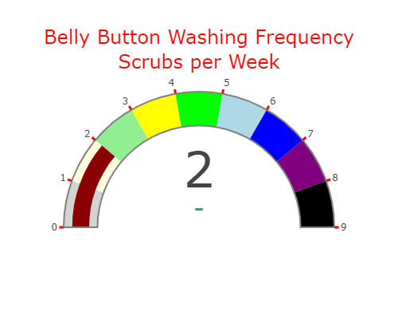

# belly-button-challenge
In this project, we will  explore the Belly Button Biodiversity dataset, which catalogs the microbes that colonize human navels. 
In this project, we will see how to use JavaScript to retrieve data from a Json file and build an interactive dashboard.

Link to the website: https://robdunnlab.com/projects/belly-button-biodiversity/

## What we will learn from this project:

- How to interact between HTML and JavaScript code to create a dynamic web application

- How to retrieve data from a Json file (provided in URL link too: https://2u-data-curriculum-team.s3.amazonaws.com/dataviz-classroom/v1.1/14-Interactive-Web-Visualizations/02-Homework/samples.json)

- How to create charts using the retrieved data

- How to display a sample metadata

- How to build an interactive dashboard

- To create functions related to events in JavaScript

 ## Instructions: 
 
  - Use the D3 library to read in samples.json from the URL,

  - Create a bubble chart that displays each sample

  - Display the sample metadata, i.e., an individual's demographic information

  - Display each key-value pair from the metadata JSON object somewhere on the page

  - Update all the plots when a new sample is selected

  - Create a gauge Chart to plot the weekly washing frequency of the individual (optional)

 ## Program:

### Tools:

- Visual Studio Code (VSCode): is a free, open-source code editor developed by Microsoft.
- Javascript: is a programming language primarily used for web development.

- HTML: is the standard markup language for documents designed to be displayed in a web browser.

- D3.js:  is a JavaScript library for manipulating and visualizing data in web browsers.

- CSS: is a stylesheet language used for describing the presentation and formatting of documents written in HTML.

- Plotly: is an open-source data visualization library for creating interactive, web-based graphical visualizations in Python, R, and JavaScript.

### Code:

#### HTML: index.html
```
<!DOCTYPE html>
<html lang="en">

<head>
  <meta charset="UTF-8">
  <meta name="viewport" content="width=device-width, initial-scale=1.0">
  <meta http-equiv="X-UA-Compatible" content="ie=edge">
  <title>Bellybutton Biodiversity</title>
  <link rel="stylesheet" href="https://maxcdn.bootstrapcdn.com/bootstrap/3.3.7/css/bootstrap.min.css">
  <style>
    #gauge .gauge-axis text {
      fill: white !important; 
  }
    body {
        background-image: url('bacteria.jpg'); 
        background-size: cover; 
        background-repeat: no-repeat;
       
      }

    
</style>
</head>

<body>

  <div class="container">
    <div class="row">
      <div class="col-md-12 jumbotron text-center"style="width: 1250px;background: linear-gradient(45deg, #f06, #9f6);background-size: 200% 200%; animation: gradientAnimation 5s linear infinite;">
        <h1>Belly Button Biodiversity Dashboard</h1>
        <p>Use the interactive charts below to explore the dataset</p>
      </div>
    </div>
    <style>
      /* Define the keyframes for the background animation */
      @keyframes gradientAnimation {
          0% {
              background-position: 0% 50%;
          }
          100% {
              background-position: 100% 50%;
          }
      }
  </style>
    <div class="row">
      <div class="col-md-2">
        <div class="well">
          <h5>Test Subject ID No.:</h5>
          <select id="selDataset" onchange="optionChanged(this.value)"></select>
        </div>
        <div class="panel panel-primary">
          <div class="panel-heading">
            <h3 class="panel-title">Demographic Info</h3>
          </div>
          <div id="sample-metadata" class="panel-body"></div>
        </div>
      </div>
      <div class="col-md-5">
        <div id="bar"></div>
      </div>
      <div class="col-md-5">
        <div id="gauge"></div>
      </div>
    </div>
    <div class="row">
      <div class="col-md-12">
        <div id="bubble"></div>
      </div>
    </div>
  </div>

  <script src="https://d3js.org/d3.v7.min.js"></script>
  <script src="https://cdn.plot.ly/plotly-latest.min.js"></script>
  <script src="./static/js/app.js"></script>
 

</body>

</html>

```
#### JavaScript: app.js
```
// URL
const url = 'https://2u-data-curriculum-team.s3.amazonaws.com/dataviz-classroom/v1.1/14-Interactive-Web-Visualizations/02-Homework/samples.json';

// Function to update bar chart
function barchart(samp,id) {
  let outid10 = samp.otu_ids.slice(0, 10);
  let sample10 = samp.sample_values.slice(0, 10);
  let labels10 = samp.otu_labels.slice(0, 10);

  let bartrace = {
    type: 'bar',
    orientation: 'h',
    x: sample10.reverse(),
    y: outid10.map(otu => `OTU ${otu}`).reverse(),
    hovertext: labels10.reverse(),
  };

  let barch = [bartrace];

  let barlayout = {
    title: {text:`Top 10 OTUs: for ID ${id}`,
            font: { color: "red", size: 24 }},
    height: 400,
    
  };
 // Create the bar chart
  Plotly.newPlot('bar', barch, barlayout);
}

// Function to update bubble chart
function bubblechart(samp,id) {
  let bubbletrace = {
    type: 'scatter',
    mode: 'markers',
    x: samp.otu_ids,
    y: samp.sample_values,
    text: samp.otu_labels,
    marker: {
      size: samp.sample_values,
      color: samp.otu_ids,
      colorscale: "Earth",
    
    },
  };

  let bubblech = [bubbletrace];

  let bubblelayout = {
    title: {text:`Bacteria Cultures Per Sample: for ID ${id}`, 
    font: { color: "red", size: 24 } } ,
    width: 1180,
    xaxis: { title: "OTU ID" },
    height:600

  };
 // Create the bubble chart
  Plotly.newPlot('bubble', bubblech, bubblelayout);
}

// Function to update gauge chart
function gaugechart(wfreq,id) {
  let gaugetrace = {
    type: "indicator",
    mode: "gauge+number+delta",
    value: wfreq,
    title: {
      text: `Belly Button Washing Frequency<br>Scrubs per Week:  for ID ${id}`, 
      font: { color: "red", size: 24 },
      delta: { reference: 9, increasing: { color: "RebeccaPurple" } }
    },
    gauge: {
      axis: {
          range: [0, 9], 
          tickvals: [0, 1, 2, 3, 4, 5, 6, 7, 8, 9], 
          
          tickcolor: "red",
          tickwidth: 3
      },
      bar: { color: "darkred" },
      bgcolor: "white",
      borderwidth: 2,
      bordercolor: "gray",
      steps: [
          { range: [0, 1], color: "lightgray" },
          { range: [1, 2], color: "lightyellow" },
          { range: [2, 3], color: "lightgreen" },
          { range: [3, 4], color: "yellow" },
          { range: [4, 5], color: "lime" },
          { range: [5, 6], color: "lightblue" },
          { range: [6, 7], color: "blue" },
          { range: [7, 8], color: "purple" },
          { range: [8, 9], color: "darkpurple" }
      ]
    }
  };

  let gaugechart = [gaugetrace];

  let gaugelayout = {
    width: 500,
    height: 400,
    margin: { t: 0, b: 0 },
    paper_bgcolor: "white"
  };

  // Create the gauge chart
  Plotly.newPlot("gauge", gaugechart, gaugelayout);
}

// Function optionChanged
function optionChanged(selectedvalue) {
  d3.json(url).then(function(data) {
    displaymetadata(selectedvalue, data);
    // Get the data for the bar and bubble chart
    let sampdata = data.samples.find(sample => sample.id === selectedvalue);
    barchart(sampdata,selectedvalue);
    bubblechart(sampdata,selectedvalue);
    // Get the data for the gauge chart
    let indata = data.metadata.find(metadata => metadata.id == selectedvalue); 
    let wfreq = indata.wfreq;
    gaugechart(wfreq,selectedvalue);
  });
}

// Function to display sample metadata
function displaymetadata(indid, data) {
  let indata = data.metadata.find(metadata => metadata.id == indid);
  document.getElementById('sample-metadata').innerHTML = '';

  for (let [key, value] of Object.entries(indata)) {
    let p = document.createElement('p');
    p.textContent = `${key}: ${value}`;
    document.getElementById('sample-metadata').appendChild(p);
  }
}

// Populate the dropdown from the JSON data
d3.json(url).then(function(data) {
  let names = data.names;

  // Select the first item from the list of names
  let initialitem = names[0];

  // Append items to the dropdown
  names.forEach((name) => {
    d3.select("#selDataset").append("option").text(name);
  });

  // Set the selected item in the dropdown to the first item
  d3.select("#selDataset").property("value", initialitem);

  // Call the optionChanged function to update the charts and metadata
  optionChanged(initialitem);
});
```
#### Charts
 
 
 

#### Bonus:
Add mouse events: mouseenter & mouseleave

```
// Add events mousenter and mouseleave to display the type of chart 
// Bar chart
// Get the div element and add a mouseenter event listener
let bardiv = document.getElementById("bar");
bardiv.addEventListener("mouseenter", function() {
  // Create a text element to display the chart title
  let title = document.createElement("p");
  title.textContent = "Bar Chart Top 10 OTUs";

  // Style the text element to display it on top
  title.style.fontWeight = "bold";
  title.style.fontStyle = "italic";
  title.style.position = "absolute";
  title.style.top = "0"; 
  title.style.backgroundColor = "black";
  title.style.color = "yellow";
  
  // Append the text element to the div
  bardiv.appendChild(title);
});

// Add a mouseleave event listener to remove the text when the mouse leaves
bardiv.addEventListener("mouseleave", function() {
  let title = bardiv.querySelector("p");
  bardiv.removeChild(title);
 
});

// Bubble chart
// Get the div element and add a mouseenter event listener
let bubblediv = document.getElementById("bubble");
bubblediv.addEventListener("mouseenter", function() {
  // Create a text element to display the chart title
  let title = document.createElement("p");
  title.textContent = "Bubble Chart";

  // Style the text element to display it on top
  title.style.fontWeight = "bold";
  title.style.fontStyle = "italic";
  title.style.position = "absolute";
  title.style.top = "0"; 
  title.style.backgroundColor = "black";
  title.style.color = "cyan";
  
  // Append the text element to the div
  bubblediv.appendChild(title);
});

// Add a mouseleave event listener to remove the text when the mouse leaves
bubblediv.addEventListener("mouseleave", function() {
  let title = bubblediv.querySelector("p");
  bubblediv.removeChild(title);
 
});

// Gauge chart
// Get the div element and add a mouseenter event listener
let gaugediv = document.getElementById("gauge");
gaugediv.addEventListener("mouseenter", function() {
  // Create a text element to display the chart title
  let title = document.createElement("p");
  title.textContent = "Gauge Chart";

  // Style the text element to display it on top
  title.style.fontWeight = "bold";
  title.style.fontStyle = "italic";
  title.style.position = "absolute";
  title.style.top = "0"; 
  title.style.backgroundColor = "black";
  title.style.color = "magenta";
  
  // Append the text element to the div
  gaugediv.appendChild(title);
});

// Add a mouseleave event listener to remove the text when the mouse leaves
gaugediv.addEventListener("mouseleave", function() {
  let title = gaugediv.querySelector("p");
  gaugediv.removeChild(title);
 
});


```
##### Supports: 
Slack AskBCS Learning Assistant
https://www.makeuseof.com/animated-background-html-css/

